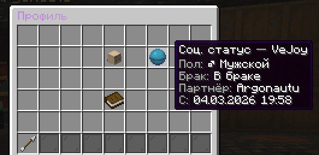

# RefontSocialExtended

<div align="center">
  
  
  
</div>

Форк [RizonChik/RefontSocial](https://github.com/RizonChik/RefontSocial) с расширенной социальной системой: репутация, история голосов, брак, гендерный профиль, дополнительные PlaceholderAPI-плейсхолдеры и SQL-ориентированное хранение данных.

## Что добавлено в этом форке

- Система брака с предложением, дистанционными проверками и отображением статуса в профиле
- Система друзей с GUI, запросами и уведомлениями
- Система гендера с командами, метками, emoji и отдельными tab-emoji цветами
- **Система стран с предопределённым списком и флагами (🇷🇺, 🇺🇦, 🇺🇸 и др.)**
- **Система даты рождения с автоматическим расчётом возраста и индикатором дня рождения в TAB**
- Дополнительные PlaceholderAPI-плейсхолдеры для гендера, брака, страны и возраста
- SQL-персистентность для marriage/gender/friends/**country/birthday** данных
- Команды `/marry`, `/gender`, `/sit`, `/friends`, **`/country`**, **`/age`**
- Расширенный профиль игрока с раздельными иконками для страны, возраста, пола и брака
- Поддержка runtime-загрузки библиотек для SQLite/MySQL
- Актуальные дефолты для `MYSQL` и Bayesian-рейтинга в конфиге форка

## Базовые возможности

- Лайк/дизлайк репутации через команду или GUI
- Теги/причины оценки
- Профиль игрока: рейтинг, место в топе, лайки/дизлайки, топ-теги, история оценок
- Топы по категориям: рейтинг, лайки, дизлайки, голоса
- Антиабуз: кулдауны, дневной лимит, запрет self-vote, IP-защита, требование близкого взаимодействия
- Защита от оценки игроков, которые ни разу не заходили
- PlaceholderAPI-плейсхолдеры для таба, чата и скоров
- Хранилище на выбор: `SQLITE`, `MYSQL`, `YAML`
- Алгоритмы рейтинга: `SIMPLE_RATIO` и `BAYESIAN`

## Требования

- Paper/Spigot/Bukkit: `1.16.5–1.21.x`
- Java: `17+` для этого форка

Опционально:

- `PlaceholderAPI`

## Установка

1. Собери jar этого форка.
2. Помести `.jar` в папку `plugins/`.
3. Перезапусти сервер.
4. Настрой `config.yml`, `messages.yml`, `gui.yml` и `tags.yml`.
5. Если используешь `MYSQL`, укажи параметры подключения в `storage.mysql`.
6. Если нужны плейсхолдеры в TAB/scoreboard/chat, установи `PlaceholderAPI`.

Плагин создаст нужные файлы при первом запуске.

## Загрузка

- Репозиторий: `https://github.com/Ve-Jo/refontsocial-extended`
- Releases: `https://github.com/Ve-Jo/refontsocial-extended/releases`

Если релиз уже опубликован, можно скачать готовый jar из GitHub Releases и не собирать проект вручную.

## Быстрый старт

- `/rep` — показать свой рейтинг
- `/rep ник` — открыть меню оценки игрока
- `/rep profile ник` — профиль игрока
- `/rep top` — общий топ по рейтингу
- `/marry help` — команды системы брака
- `/gender help` — команды гендерного профиля
- `/friends help` — команды системы друзей
- **`/country help` — команды выбора страны**
- **`/age help` — команды установки даты рождения**

## Скриншоты

### Статус брака в профиле `/rep profile`



## Команды

### Репутация

- `/reputation`
- `/rep`
- `/rating`
- `/social`

Основные сценарии:

- `/rep` — показать свой рейтинг
- `/rep ник` — открыть меню оценки игрока
- `/rep like ник` — поставить лайк
- `/rep dislike ник` — поставить дизлайк
- `/rep profile ник` — открыть профиль игрока
- `/rep top`
- `/rep top score|likes|dislikes|votes`

### Администрирование

- `/repreload` — перезагрузка конфига/GUI/сообщений

### Брак

- `/marry`
- `/marriage`

### Гендер

- `/gender`

### Позиционные команды

- `/sit` — сесть на блок

### Страна

- `/country` — показать текущую страну
- `/country <название>` — установить страну (поддерживается частичный ввод: `ukr` → `🇺🇦 Ukraine`)
- `/country set <название>` — установить страну
- `/country list` — список доступных стран с флагами
- `/country clear` — удалить страну

### Возраст/Дата рождения

- `/age` — показать дату рождения и возраст
- `/age <дд.мм.гггг>` — установить дату рождения (раз в месяц)
- `/age clear` — удалить дату рождения

### Друзья

- `/friends` — открыть меню друзей
- `/friends add <ник>` — добавить в друзья
- `/friends remove <ник>` — удалить из друзей
- `/friends accept` — принять запрос в друзья
- `/friends deny` — отклонить запрос

## Права

- `refontsocial.use` — доступ к репутации
- `refontsocial.admin` — админские возможности и `repreload`
- `refontsocial.bypass.cooldown` — обход кулдаунов/лимитов
- `refontsocial.bypass.interaction` — обход требования взаимодействия рядом
- `refontsocial.bypass.ip` — обход защиты по IP
- `refontsocial.marry.use` — доступ к браку
- `refontsocial.gender.use` — доступ к гендерному профилю
- `refontsocial.sit.use` — доступ к `/sit`
- **`refontsocial.country.use` — доступ к `/country`**
- **`refontsocial.age.use` — доступ к `/age`**
- `refontsocial.friends.use` — доступ к системе друзей

## PlaceholderAPI

### Основные

- `%refontsocial_score%` — рейтинг игрока
- `%refontsocial_likes%` — лайки
- `%refontsocial_dislikes%` — дизлайки
- `%refontsocial_votes%` — всего голосов
- `%refontsocial_rank%` — место в топе

### Топ-плейсхолдеры

- `%refontsocial_nick_1%`
- `%refontsocial_score_1%`
- `%refontsocial_like_1%`
- `%refontsocial_dislike_1%`
- `%refontsocial_votes_1%`

Аналогично: `_2`, `_3`, ... в пределах `placeholders.topMax`.

- `%refontsocial_friends_count%` — количество друзей
- `%refontsocial_friends_online_count%` — количество друзей онлайн

### Плейсхолдеры форка

- `%refontsocial_gender%` — emoji + текстовая метка выбранного гендера
- `%refontsocial_gender_emoji%` — emoji выбранного гендера
- `%refontsocial_gender_emoji_tab%` — emoji гендера для TAB с безопасным цветом/спейсингом
- `%refontsocial_married%` — `true` / `false`
- `%refontsocial_marriage_status%` — локализованный статус брака
- `%refontsocial_spouse%` — имя супруга(и) или fallback из конфига
- `%refontsocial_marriage_since%` — дата брака в формате `marriage.dateFormat`
- `%refontsocial_marriage_duration%` — длительность брака в формате elapsed time
- **`%refontsocial_country%` — страна игрока с флагом**
- **`%refontsocial_age%` — возраст игрока (вычисляется из даты рождения)**
- **`%refontsocial_birthday%` — дата рождения**
- **`%refontsocial_birthday_emoji%` — emoji для TAB когда у игрока день рождения**

## Как считается рейтинг

Рейтинг хранится на шкале `min..max` из конфига.

Доступны 2 алгоритма:

- `SIMPLE_RATIO` — простая доля лайков
- `BAYESIAN` — сглаживание первых голосов

В текущем форке дефолты ориентированы на более стабильный старт:

- `rating.scale.max: 100.0`
- `rating.defaultScore: 10.0`
- `rating.bayesian.priorVotes: 50`

## Конфигурация

Главные файлы:

- `config.yml`
- `messages.yml`
- `gui.yml`
- `tags.yml`
- **`countries.yml` — список стран с флагами**

### Основные секции `config.yml`

- `storage`
  - `SQLITE` / `MYSQL` / `YAML`
  - пул соединений для MySQL
  - runtime-библиотеки для JDBC
- `rating`
  - шкала, формат и алгоритм рейтинга
- `antiAbuse`
  - self-vote
  - eligibility target'а
  - IP-защита
  - кулдауны
  - proximity/interactions
  - дневной лимит
- `reasons`
  - включение причин/тегов и обязательность выбора
- `profile`
  - история голосов
  - top tags
  - статусный слот для пола/брака
- `marriage`
  - предложения, дистанция, тексты статуса, формат даты
- `gender`
  - дефолтный статус
  - возможность самосмены
  - emoji
  - tab-emoji colors
  - labels
- `gui`
  - размеры и заголовки меню
- `performance`
  - кэш профилей
- `placeholders`
  - fallback и лимит top placeholder'ов
- `libraries`
  - настройка автозагрузки JDBC-библиотек
- **`country` — настройки страны**
- **`birthday` — настройки даты рождения (мин/макс возраст, emoji для TAB)**

## Пример MySQL-настройки

```yaml
storage:
  type: MYSQL

  mysql:
    host: "localhost"
    port: 3306
    database: "refontsocial"
    username: "root"
    password: "change-me"
    useSSL: false
```

### Расширенный пример storage

```yaml
storage:
  type: MYSQL

  mysql:
    host: "localhost"
    port: 3306
    database: "refontsocial"
    username: "root"
    password: "change-me"
    useSSL: false
    serverTimezone: "UTC"
    params: "useUnicode=true&characterEncoding=utf8&autoReconnect=true&useJDBCCompliantTimezoneShift=true&useLegacyDatetimeCode=false"
    pool:
      maximumPoolSize: 10
      minimumIdle: 2
      connectionTimeoutMs: 10000
      idleTimeoutMs: 600000
      maxLifetimeMs: 1800000
```

### Пример anti-abuse

```yaml
antiAbuse:
  preventSelfVote: true

  targetEligibility:
    requireHasPlayedBefore: true
    requireTargetOnline: false

  ipProtection:
    enabled: true
    mode: SAME_IP_DENY
    cooldownSeconds: 86400

  cooldowns:
    voteGlobalSeconds: 20
    sameTargetSeconds: 600
    changeVoteSeconds: 1800

  requireInteraction:
    enabled: true
    radiusBlocks: 100.0
    interactionValidSeconds: 86400
    taskPeriodTicks: 40

  dailyLimit:
    enabled: true
    maxVotesPerDay: 20
```

### Пример marriage

```yaml
marriage:
  enabled: true
  proposalExpireSeconds: 120
  proximity:
    enabled: true
    radius: 50.0
    checkPeriodTicks: 40
  actions:
    requiredDistance: 4.0
  marriedText: "В браке"
  singleText: "Не в браке"
  notMarriedSpouseText: "-"
  notMarriedSinceText: "-"
  dateFormat: "dd.MM.yyyy HH:mm"
```

### Пример gender

```yaml
gender:
  default: "undisclosed"
  allowSelfChange: true
  tabEmojiColors:
    male: "&b"
    female: "&d"
    nonbinary: "&5"
    other: "&7"
    undisclosed: ""
  emojis:
    male: "♂"
    female: "♀"
    nonbinary: "⚧"
    other: "◌"
    undisclosed: ""
  labels:
    male: "Мужской"
    female: "Женский"
    nonbinary: "Небинарный"
    other: "Другое"
    undisclosed: "Не указан"
```

## Технические заметки

- Имя плагина: `RefontSocialExtended`
- Main class: `ru.rizonchik.refontsocial.RefontSocial`
- Soft depend: `PlaceholderAPI`
- Сборка форка ориентирована на Java 17
- Итоговый jar: `RefontSocialExtended-1.4.0-extended-SNAPSHOT.jar`

## Credits

- Оригинальный проект: `RizonChik/RefontSocial`
- Расширения и поддержка форка: `ayosynk`
